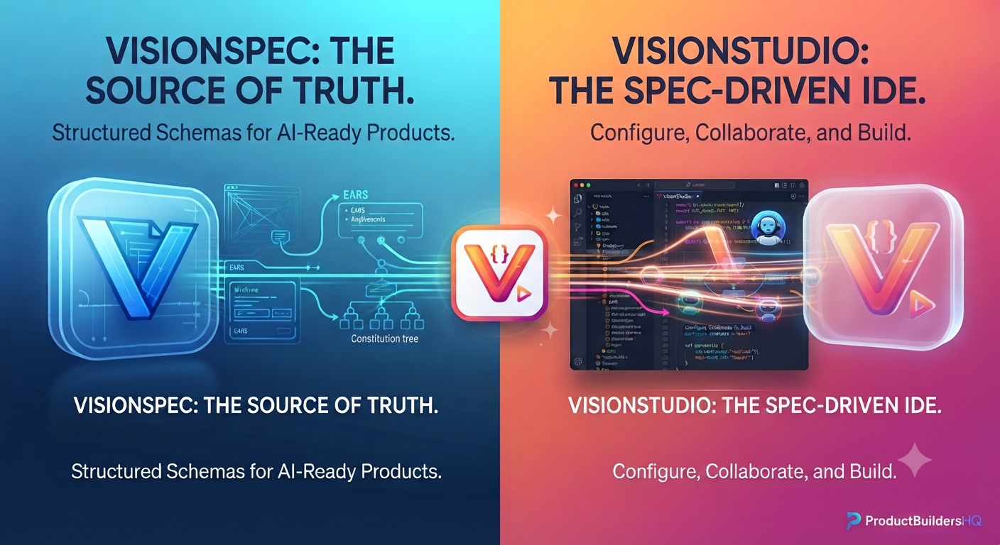

# VisionSpec

[](https://productbuildershq.com/visionspec/)

[![Go CI][go-ci-svg]][go-ci-url]
[![Go Lint][go-lint-svg]][go-lint-url]
[![Go SAST][go-sast-svg]][go-sast-url]
[![Docs][docs-godoc-svg]][docs-godoc-url]
[![Docs][docs-mkdoc-svg]][docs-mkdoc-url]
[![Visualization][viz-svg]][viz-url]
[![License][license-svg]][license-url]

 [go-ci-svg]: https://github.com/ProductBuildersHQ/visionspec/actions/workflows/go-ci.yaml/badge.svg?branch=main
 [go-ci-url]: https://github.com/ProductBuildersHQ/visionspec/actions/workflows/go-ci.yaml
 [go-lint-svg]: https://github.com/ProductBuildersHQ/visionspec/actions/workflows/go-lint.yaml/badge.svg?branch=main
 [go-lint-url]: https://github.com/ProductBuildersHQ/visionspec/actions/workflows/go-lint.yaml
 [go-sast-svg]: https://github.com/ProductBuildersHQ/visionspec/actions/workflows/go-sast-codeql.yaml/badge.svg?branch=main
 [go-sast-url]: https://github.com/ProductBuildersHQ/visionspec/actions/workflows/go-sast-codeql.yaml
 [docs-godoc-svg]: https://pkg.go.dev/badge/github.com/ProductBuildersHQ/visionspec
 [docs-godoc-url]: https://pkg.go.dev/github.com/ProductBuildersHQ/visionspec
 [docs-mkdoc-svg]: https://img.shields.io/badge/Go-dev%20guide-blue.svg
 [docs-mkdoc-url]: https://productbuildershq.com/visionspec
 [viz-svg]: https://img.shields.io/badge/Go-visualizaton-blue.svg
 [viz-url]: https://mango-dune-07a8b7110.1.azurestaticapps.net/?repo=ProductBuildersHQ%2Fvisionspec
 [loc-svg]: https://tokei.rs/b1/github/ProductBuildersHQ/visionspec
 [repo-url]: https://github.com/ProductBuildersHQ/visionspec
 [license-svg]: https://img.shields.io/badge/license-MIT-blue.svg
 [license-url]: https://github.com/ProductBuildersHQ/visionspec/blob/main/LICENSE

Multi-domain specification orchestration for humans and AI agents.

## Overview

VisionSpec bridges the gap between organizational intent and executable specifications for AI coding agents. It implements **[Amazon's Working Backwards methodology][working-backwards]** to ensure every requirement traces back to a specific customer outcome.

[working-backwards]: https://www.amazon.com/Working-Backwards-Insights-Stories-Secrets/dp/1250267595/ "Working Backwards by Colin Bryar and Bill Carr (St. Martin's Press, 2021)"

**Key Capabilities:**

- 📣 **Working Backwards flow** - Start with vision (Press Release), derive requirements (PRD)
- 🎯 **Methodology profiles** - AWS, Google, Stripe, Lean Startup, Design Thinking, JTBD
- ✍️ **Domain-specific authoring** - Separate specs for PM, UX, Engineering
- ⚙️ **LLM synthesis** - Generate Press, FAQ, PRD, TRD, TPD, IRD from source specs
- 📊 **Structured evaluation** - Per-domain LLM judges with customizable rubrics
- 🔄 **Reconciliation** - Conflict detection and tradeoff resolution
- 📦 **Target adapters** - Export to SpecKit, GSD, GasTown, GasCity, AWS AI-DLC, OpenSpec

All synthesized documents are committed to git and can be reviewed, edited, and refined by humans or collaboratively with AI assistants.

## Installation

```bash
go install github.com/ProductBuildersHQ/visionspec/cmd/visionspec@v0.10.0
```

## Quick Start

```bash
# Initialize a new project
visionspec init user-onboarding

# Or with a specific workflow methodology
visionspec init user-onboarding --workflow=aws-working-backwards/product

# Validate project structure
visionspec lint

# Check project status
visionspec status
visionspec status --format json
visionspec status --format html > status.html
```

## Spec-Workflows Integration

VisionSpec can load workflows, templates, and rubrics from external [spec-workflows](https://github.com/ProductBuildersHQ/spec-workflows) repositories. This enables organizations to fork and customize methodologies.

```bash
# Clone spec-workflows (auto-discovered from ~/.config/visionspec/)
git clone https://github.com/ProductBuildersHQ/spec-workflows ~/.config/visionspec/spec-workflows

# List available workflows
visionspec workflows

# Initialize with a specific methodology
visionspec init my-product --workflow=aws-working-backwards/product
visionspec init my-feature --workflow=lean-startup/feature
```

Auto-discovery searches: `--workflows-repo` flag → `VISIONSPEC_WORKFLOWS_REPO` env → upward directory walk → `~/.config/visionspec/spec-workflows/`

## Directory Structure

```
docs/specs/
├── CONSTITUTION.md                    # Repo-level governance
├── ROADMAP.md                         # Cross-project priorities
└── {project}/                         # kebab-case project name
    ├── source/                        # Human-authored specs
    │   ├── mrd.md
    │   ├── prd.md
    │   └── uxd.md
    ├── gtm/                           # LLM-generated GTM docs
    │   ├── press.md
    │   ├── faq.md
    │   └── narrative.md
    ├── technical/                     # LLM-generated technical docs
    │   ├── trd.md
    │   ├── tpd.md
    │   └── ird.md
    ├── eval/                          # All evaluations
    │   ├── mrd.eval.json
    │   ├── prd.eval.json
    │   └── ...
    ├── .graphize/                     # Requirement graph
    ├── spec.md                        # Reconciled execution spec
    ├── current-truth.md               # Post-ship state
    ├── status.html                    # Readiness report
    ├── index.md                       # MkDocs page
    └── visionspec.yaml                 # Configuration
```

## Working Backwards Flow

VisionSpec implements Amazon's Working Backwards methodology. Instead of starting with requirements and hoping they lead to a good customer experience, you start with the vision and work backwards:

```
1. MARKET PROBLEM (human-authored)
   mrd.md
       ↓
2. WORKING BACKWARDS (synthesized, editable)
   press.md  →  faq.md  →  prd.md
   (vision)     (scope)    (requirements)
       ↓
3. STAKEHOLDER REVIEW (synthesized, editable)
   narrative-1p.md / narrative-6p.md
       ↓
4. USER EXPERIENCE (human-authored)
   uxd.md
       ↓
5. TECHNICAL SPECS (synthesized, editable)
   trd.md  →  tpd.md  →  ird.md
   (design)   (tests)    (infra)
       ↓
6. RECONCILIATION
   All approved specs → spec.md
       ↓
7. AI EXECUTION
   spec.md → SpecKit | GSD | GasTown | GasCity
       ↓
8. POST-SHIP ALIGNMENT
   spec.md + reality → current-truth.md
```

**Why this order?** The Press Release defines the customer experience before any requirements are written. The FAQ challenges that vision and surfaces gaps. Only then is the PRD derived—grounded in a validated vision rather than abstract feature lists.

See [Working Backwards](https://productbuildershq.com/visionspec/concepts/working-backwards/) for the full methodology.

## CLI Commands

Full documentation: [CLI Reference](https://productbuildershq.com/visionspec/cli/)

### Project Setup

| Command | Description |
|---------|-------------|
| `init <project>` | Initialize a new project |
| `create <type>` | Scaffold a new spec from template |
| `lint [project]` | Validate directory structure |
| `status` | Show project status and readiness |
| `workflow` | Display workflow DAG with dependencies |
| `profiles <cmd>` | Manage configuration profiles |

### Spec Workflow

| Command | Description |
|---------|-------------|
| `eval [type]` | Evaluate specs using LLM judges |
| `synthesize <type>` | Generate GTM/technical specs from sources |
| `reconcile` | Generate unified execution spec |
| `approve <type>` | Approve a spec for reconciliation |

### Export & Integration

| Command | Description |
|---------|-------------|
| `export <target>` | Export to target execution system |
| `targets` | List available export targets |
| `serve` | Start MCP server for AI integration |
| `docs <cmd>` | Generate MkDocs documentation |
| `rules <cmd>` | Export workflow rules for AI assistants |

### Execution Alignment

| Command | Description |
|---------|-------------|
| `align` | Check spec-to-reality alignment |
| `drift` | Detect spec-to-code drift |
| `generate tests` | Generate test stubs from TPD |
| `sync <target>` | Sync execution state with target system |
| `metrics` | View evaluation metrics dashboard |
| `hooks <cmd>` | Manage Git hooks (install, uninstall, status) |

### Cross-Project Analysis

| Command | Description |
|---------|-------------|
| `search <query>` | Full-text search across spec files |
| `reuse` | Analyze requirement reuse opportunities |
| `patterns` | Detect patterns and anti-patterns |

### Context & Traceability

| Command | Description |
|---------|-------------|
| `context <cmd>` | Gather codebase context |
| `graph <cmd>` | Manage requirement graphs |
| `workflows` | List available workflows from spec-workflows repo |

## Status Command

The `status` command shows project readiness with multiple output formats:

```bash
# Terminal output with readiness gates
visionspec status -p myproject

# JSON for programmatic use
visionspec status -p myproject --format json

# HTML report with traffic light indicator
visionspec status -p myproject --format html > status.html

# Markdown for embedding in docs
visionspec status -p myproject --format markdown

# CI mode - exits non-zero if not ready
visionspec status -p myproject --ci
```

### Readiness Gates

| Gate | Description |
|------|-------------|
| Required specs present | All required source specs (mrd, prd, uxd, trd) exist |
| Evaluations passing | No blocking evaluation findings |
| Approvals obtained | All required specs have approvals |
| Execution spec generated | `spec.md` has been created |

## MCP Server

VisionSpec includes an MCP (Model Context Protocol) server for integration with AI coding assistants like Claude Code and Kiro CLI.

```bash
# Run MCP server directly
visionspec-mcp
```

### MCP Tools

| Tool | Description |
|------|-------------|
| `list_projects` | List all visionspec projects |
| `get_project_status` | Get project readiness status |
| `start_draft` | Initialize a new draft |
| `update_draft` | Save draft content |
| `eval_draft` | Evaluate draft against rubric |
| `finalize_draft` | Promote draft to final spec |
| `get_draft` | Retrieve current draft |
| `discard_draft` | Delete a draft |
| `get_spec` | Get specification content |
| `get_eval` | Get evaluation results |
| `run_eval` | Run evaluation against rubric |
| `synthesize` | Generate a spec |
| `reconcile` | Generate execution spec |
| `approve` | Approve a specification |
| `export` | Export to target system |
| `align_spec` | Run alignment checking |
| `get_alignment_status` | Get alignment status |
| `track_resolution` | Track discrepancy resolution |
| `get_metrics` | Get evaluation metrics |
| `install_hooks` | Install git hooks |
| `get_hooks_status` | Get hooks status |
| `get_execution_status` | Track requirement implementation progress |
| `track_requirement` | Update requirement status with evidence |

## Export Targets

| Target | Description |
|--------|-------------|
| `speckit` | GitHub Spec-Kit format |
| `gsd` | Get Shit Done (PLAN.md, STATE.md) |
| `gastown` | GasTown formulas and beads |
| `gascity` | GasCity city.toml configuration |
| `aidlc` | AWS AI-DLC Workflows (vision-document.md, technical-environment.md) |
| `openspec` | OpenSpec portable JSON/YAML format |
| `github` | GitHub Issues (milestones, labels) |
| `jira` | Jira epics/stories |

## Configuration Profiles

VisionSpec includes two types of profiles:

### Stage-Based Profiles

For different product lifecycle stages:

| Profile | Required Specs | Use Case |
|---------|---------------|----------|
| `0-1` | hypothesis | Idea validation phase |
| `startup` | prd | Pre-PMF startups |
| `growth` | prd, uxd, faq | 1-N scaling phase |
| `enterprise` | mrd, prd, uxd, trd, press, faq, spec | Post-PMF enterprises |

### Methodology Profiles

For different organizational methodologies:

| Profile | Methodology | Best For |
|---------|-------------|----------|
| `aws-product` | Working Backwards (MRD start) | New product lines (PR/FAQ, 6-pager) |
| `aws-feature` | Working Backwards (OpportunitySpec start) | Features on existing products |
| `big-tech-product` | Multi-company best practices | Enterprise products (10 methodologies) |
| `big-tech-feature` | Multi-company feature workflow | Enterprise features (comprehensive) |
| `big-tech-essentials-product` | Streamlined best practices | Growing companies (3 core methodologies) |
| `google` | Design Docs + RFC | Engineering-heavy orgs (OKRs, experiments) |
| `stripe` | API-First | Platform/API products (contract-first, DX) |
| `lean-startup` | Build-Measure-Learn | Early validation (hypothesis, MVP) |
| `design-thinking` | Stanford d.school | Human-centered design (empathy, prototyping) |
| `jtbd` | Jobs to be Done | Customer motivations (job statements, outcomes) |
| `continuous-discovery` | Teresa Torres | Continuous learning (opportunity trees) |
| `shapeup` | Basecamp | Fixed timelines (6-week cycles, pitches) |

The `aws-feature` profile uses **OpportunitySpec** from [prism-roadmap](https://github.com/grokify/prism-roadmap) as the starting document instead of MRD, providing a 12-box canvas that combines discovery (Patton) with business case rigor (Cagan).

### Using Profiles

```bash
# List available profiles
visionspec profiles list

# Show profile details
visionspec profiles show aws

# Initialize with a methodology profile
visionspec init my-product --profile aws

# Initialize with a stage profile
visionspec init my-feature --profile startup

# Export profile for customization
visionspec profiles export enterprise ./my-profile

# Initialize with custom profile directory
visionspec init my-project --profile-dir ./my-profile
```

## Organization Customization

VisionSpec is designed for organizations to build their own prescriptive CLI tools. The open source version provides flexibility and choices; organization versions enforce standards.

### Open Source vs. Organization

```
┌─────────────────────────────────────────────────────────────────┐
│                     Organization CLI                             │
│  (e.g., plexus-spec, acme-spec)                                  │
│                                                                   │
│  ┌─────────────┐  ┌─────────────┐  ┌─────────────┐              │
│  │ Org         │  │ Org         │  │ Org         │              │
│  │ Templates   │  │ Rubrics     │  │ Constitutions│             │
│  │ (prescriptive)│ │ (strict)    │  │ (defaults)  │              │
│  └──────┬──────┘  └──────┬──────┘  └──────┬──────┘              │
│         │                │                │                      │
│         ▼                ▼                ▼                      │
│  ┌─────────────────────────────────────────────────┐            │
│  │              ChainLoader (fallback)              │            │
│  └─────────────────────────────────────────────────┘            │
└─────────┬────────────────┬────────────────┬─────────────────────┘
          │                │                │
          ▼                ▼                ▼
┌─────────────────────────────────────────────────────────────────┐
│                    visionspec (open source)                      │
│                                                                   │
│  ┌─────────────┐  ┌─────────────┐  ┌─────────────┐              │
│  │ Default     │  │ Default     │  │ Built-in    │              │
│  │ Templates   │  │ Rubrics     │  │ App Types   │              │
│  │ (flexible)  │  │ (choices)   │  │ (generic)   │              │
│  └─────────────┘  └─────────────┘  └─────────────┘              │
└─────────────────────────────────────────────────────────────────┘
```

| Aspect | Open Source | Organization |
|--------|-------------|--------------|
| **Templates** | Choices (fill in blanks) | Prescriptive (pre-filled) |
| **Rubrics** | "Database choice documented" | "MUST use PostgreSQL with RLS" |
| **Constitutions** | None (orgs provide) | Built-in org/team defaults |
| **App Types** | Generic constraints | Stricter requirements |

### Building an Organization CLI

Organizations embed their resources and use `ChainLoader` to try org-specific first, falling back to visionspec defaults:

```go
import (
    "embed"
    "github.com/ProductBuildersHQ/visionspec/pkg/cli"
    "github.com/ProductBuildersHQ/visionspec/pkg/constitution"
    "github.com/ProductBuildersHQ/visionspec/pkg/templates"
)

//go:embed templates/*.md
var orgTemplates embed.FS

//go:embed constitutions/**/*.yaml
var orgConstitutions embed.FS

func main() {
    root := &cobra.Command{Use: "org-spec"}
    cfg := cli.DefaultConfig()

    // Org templates first, fall back to visionspec defaults
    cfg.TemplateLoader = templates.NewChainLoader(
        templates.NewEmbedFSLoader(orgTemplates, "templates"),
        templates.EmbeddedLoader(),
    )

    // Org constitutions define defaults projects inherit
    cfg.ConstitutionLoader = constitution.NewEmbeddedLoader(
        orgConstitutions, "constitutions",
    )

    cli.AddCommandsTo(root, cfg)
    root.Execute()
}
```

### Constitution Hierarchy

Constitutions define organizational defaults that flow down through inheritance:

```
org/plexusone.yaml          # Organization defaults
    ↓ inherits
team/platform-team.yaml     # Team overrides
    ↓ inherits
project/agentos.yaml        # Project-specific + exceptions
```

Example organization constitution:

```yaml
apiVersion: visionspec/v1
kind: Constitution
metadata:
  name: plexusone
  level: organization

technical:
  languages:
    backend:
      primary: go
      allowed: [go, rust]
  tenancy:
    model: multi-tenant
    isolation: rls

infrastructure:
  iac:
    tool: pulumi
    language: go
  availability:
    target: "99.9"
```

See [Organization Customization Guide](https://productbuildershq.com/visionspec/guides/organization-customization/) and `examples/org-cli/` for complete examples.

## Dependencies

- [structured-evaluation](https://github.com/plexusone/structured-evaluation) - Rubric and evaluation types
- [graphize](https://github.com/plexusone/graphize) - Requirement graph extraction
- [prism-roadmap](https://github.com/grokify/prism-roadmap) - Canvas types (OpportunitySpec, BMC, OST) and templates

## Development

```bash
# Build
make build

# Test
make test

# Lint
make lint

# Install locally
make install
```

## Project Status

See [ROADMAP.md](docs/specs/ROADMAP.md) for detailed implementation status and [CHANGELOG.md](CHANGELOG.md) for release history.

**Current Version:** v0.10.0

| Phase | Status |
|-------|--------|
| Phase 0: Foundation | Complete |
| Phase 1: Directory Structure | Complete |
| Phase 2: Evaluation Engine | Complete |
| Phase 3: GTM & Technical Synthesis | Complete |
| Phase 4: Reconciliation Engine | Complete |
| Phase 5: Target Adapters | Complete |
| Phase 6: Claude Code Integration | Complete |
| Phase 7: Graphize Integration | Complete |
| Phase 8: Advanced Features | Complete |
| Phase 9: Composability | Complete |
| Phase 10: Platform Enhancements | In Progress |
| Phase 11: Context Sources | Complete |
| Phase 12: Methodology Profiles | Complete |
| Phase 13: AI Workflow Orchestration | Complete |
| Phase 14: Execution Integration | Complete |

## License

MIT
