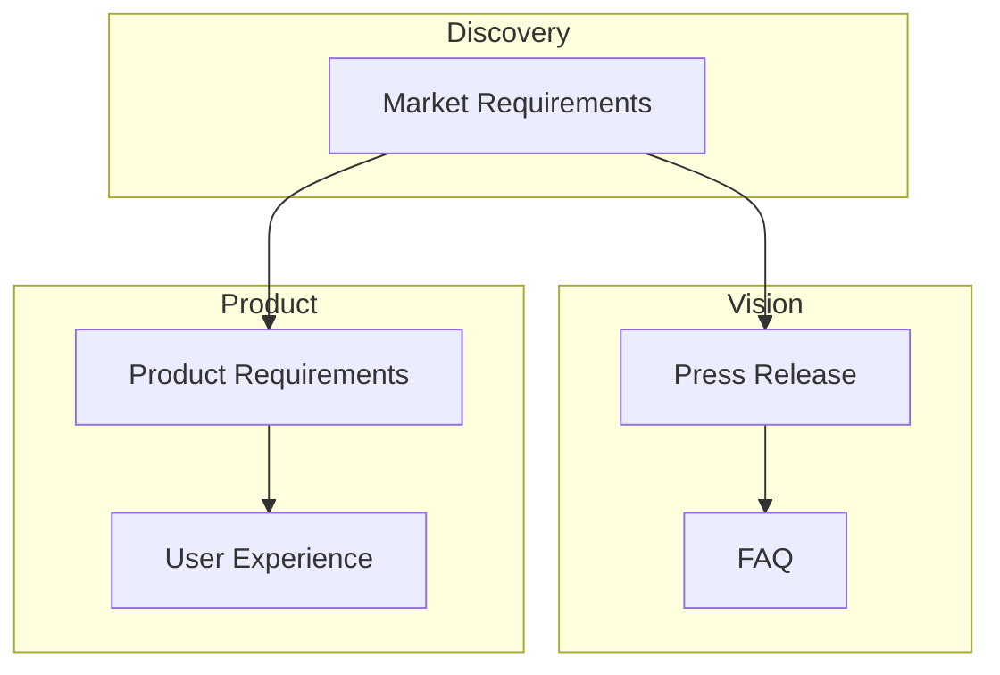

# workflow

Display the workflow DAG for a project, showing spec dependencies, phases, and progress.

## Usage

```bash
visionspec workflow [flags]
```

## Description

The `workflow` command visualizes the spec pipeline as a directed acyclic graph (DAG). It shows:

- **Phases**: Logical groupings (Discovery, Vision, Product, Technical, Reconciliation)
- **Nodes**: Spec types with their current status
- **Dependencies**: Which specs must complete before others can start
- **Progress**: Overall completion statistics

## Flags

| Flag | Short | Description |
|------|-------|-------------|
| `--project` | `-p` | Project name (required) |
| `--format` | `-f` | Output format: `mermaid` (default), `json`, `dot` |
| `--include-mermaid` | | Include Mermaid diagram in JSON output |

## Output Formats

### Mermaid (default)

Generates a Mermaid diagram for visualization:

```bash
visionspec workflow -p myproject
```



### JSON

Structured output with nodes, phases, and progress:

```bash
visionspec workflow -p myproject --format json
```

```json
{
  "name": "big-tech-product",
  "description": "Big Tech methodology for products",
  "phases": [
    {"id": "discovery", "name": "Discovery", "order": 1, "nodes": ["mrd"]},
    {"id": "vision", "name": "Vision", "order": 2, "nodes": ["press", "faq"]}
  ],
  "nodes": {
    "mrd": {
      "id": "mrd",
      "name": "Market Requirements",
      "phase": "discovery",
      "status": "completed",
      "depends_on": [],
      "automated": false
    },
    "press": {
      "id": "press",
      "name": "Press Release",
      "phase": "vision",
      "status": "in_progress",
      "depends_on": ["mrd"],
      "automated": true
    }
  },
  "progress": {
    "completed": 3,
    "total": 10,
    "percent": 30.0
  }
}
```

### DOT (GraphViz)

Generates DOT format for GraphViz tools:

```bash
visionspec workflow -p myproject --format dot
```

## Examples

### View workflow diagram

```bash
visionspec workflow -p user-onboarding
```

### Export to file for rendering

```bash
visionspec workflow -p myproject > workflow.mmd
```

### Get JSON with embedded Mermaid

```bash
visionspec workflow -p myproject --format json --include-mermaid
```

### Pipe to GraphViz

```bash
visionspec workflow -p myproject --format dot | dot -Tpng -o workflow.png
```

## Node Statuses

| Status | Description |
|--------|-------------|
| `pending` | Not started, dependencies not met |
| `ready` | Dependencies met, ready to start |
| `in_progress` | Work in progress |
| `completed` | Successfully completed |
| `blocked` | Blocked by failed dependency |
| `skipped` | Intentionally skipped |

## See Also

- [status](status.md) - Project status overview
- [profiles](profiles.md) - Workflow profiles
- [workflows](workflows.md) - External workflow repositories
