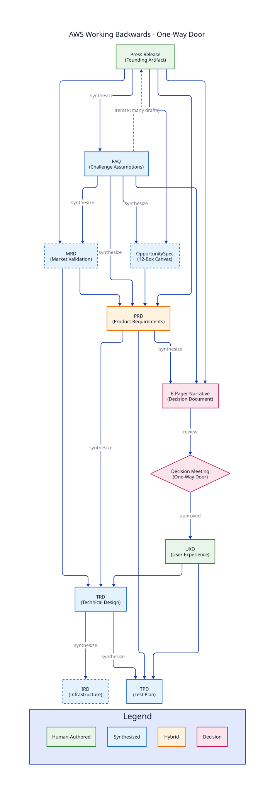
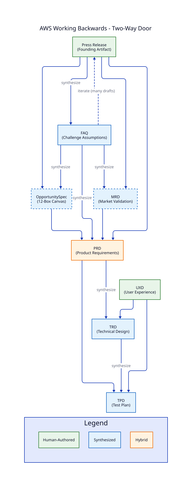

# AWS Working Backwards

Amazon's Working Backwards methodology starts with the customer and works backward to the solution. It emphasizes writing as thinking, with the PR/FAQ and 6-Pager as core artifacts.

## Profile Variants

Both profiles start the same way — with the human-authored **Press Release**, the founding artifact of Working Backwards. Amazon classifies decisions by **reversibility** (one-way vs. two-way doors), not by a product/feature taxonomy — so the profiles are named by the door. The door sets the ceremony; the scale picks the deepening tool (both are optional in both profiles):

| Profile | Founding Document | Ceremony | Typical For |
|---------|-------------------|----------|-------------|
| `aws-one-way-door` | Press Release | 6-pager decision narrative **required**; formal decision meeting gates build spend | Hard-to-reverse bets: new product lines, public commitments, major investments |
| `aws-two-way-door` | Press Release | Iterative PR/FAQ review is the only formal gate; 6-pager optional | Reversible bets: features, experiments, incremental improvements |

Optional post-FAQ deepening in either profile: **MRD** (market validation — typical at product scale) or **OpportunitySpec** (discovery canvas — typical at feature scale). For the latter, see [OpportunitySpec Framework](opportunity-spec.md).

## The Flow

### One-Way Door Flow (PR/FAQ Start)



### Two-Way Door Flow (PR/FAQ Start)



## Key Principles

1. **Customer Obsession**: Start with the customer and work backwards
2. **Write First**: Document the vision before building
3. **PR/FAQ**: Write the press release announcing the product's launch
4. **Challenge Assumptions**: Use FAQ to surface gaps and concerns
5. **Narrative-Driven**: Use 6-pagers for decision-making
6. **Iterate**: The PR/FAQ goes through many drafts — iteration is the method, not a failure of the first pass

## AI-Native Working Backwards

The methodology's division of labor maps cleanly onto AI-native building — and gets *stronger*, because AI makes the expensive parts of authenticity cheap:

| Working Backwards element | Who does it | Why |
|---|---|---|
| **Press Release** | Human | The vision seed — taste and intent are the inputs AI cannot supply. Written first, by hand, on purpose. |
| **FAQ** | Agents synthesize, human curates | Agents research the market, competitors, and constraints to stress-test the PR's claims; the human decides which answers survive. |
| **Desirability evidence** | Agents build, humans watch users | A clickable demo of the announced experience (hardcoded data, no backend) is minutes of agent work. Attach it to the PR appendix — "watch people try it" beats "we believe." |
| **Feasibility evidence** | Agents spike | The FAQ's "can we build it?" answers cite a vertical-slice proof-of-concept against real data — hours of agent work now, not weeks. Assertion-free feasibility. |
| **Evaluation** | LLM-as-a-Judge | Each document is scored against the profile's leadership-principle rubrics between drafts, so iteration has a feedback signal cheaper than a review meeting. |
| **PR/FAQ review, decision meeting** | Human | The gates stay human. The 6-pager review is the one-way-door judgment call — precisely the decision AI evidence can inform but not make. |

Two disciplines keep this honest:

- **Label the evidence.** AI makes artifacts *look* real for free, so every appendix item is marked by what it proves — a mockup illustrates, a demo tests desirability, a spike proves feasibility. Never let a facade cash a working-system claim.
- **Iterate before the gate, not after.** Cheap synthesis and cheap evaluation mean the PR/FAQ can go through its ten drafts in days. Spend the iterations where Amazon always did — on the vision documents — so the one-way-door meeting decides on a hardened narrative, and the post-gate build (UXD, TRD, TPD) starts from settled intent.

## VisionSpec Mapping

| AWS Artifact | VisionSpec Type | Purpose |
|--------------|-----------------|---------|
| Press Release | Press | **Founding artifact** — human-authored vision announcing the solution; written first |
| FAQ | FAQ | Challenges claims, surfaces gaps; absorbs the business case |
| Business Case deep-dive | MRD *(optional)* | Post-FAQ market validation when the risk warrants it (Amazon has no MRD; the FAQ carries the case) |
| PRFAQ Combined | PRD | Product requirements derived from narrative |
| 6-Pager | Narrative | Decision document for the one-way-door gate |
| Design Doc | TRD | Technical architecture |
| Test Plan | TPD | Test cases, automation, quality gates |
| Ops Review | IRD | Infrastructure and operations |

## Using the aws-one-way-door Profile

### Initialize a Project

```bash
multispec init my-product --profile aws-one-way-door
```

### Write the Press Release (Founding Artifact)

```bash
multispec draft press -p my-product
```

The press release is human-authored — it is the vision seed, not a synthesis
product. Write it first; everything else works backward from it.

### Synthesize Working Backwards Documents

```bash
# Generate FAQ challenging the Press Release
multispec synthesize faq -p my-product

# Optional: deepen the FAQ's business case with market validation
# (or `synthesize opportunity-spec` for the feature-scale discovery canvas)
multispec synthesize mrd -p my-product

# Generate PRD from Working Backwards artifacts
multispec synthesize prd -p my-product

# Generate 6-Pager Narrative for the decision gate
multispec synthesize narrative-6p -p my-product

# Generate technical specs (post-gate)
multispec synthesize trd -p my-product
multispec synthesize tpd -p my-product  # Test plan
multispec synthesize ird -p my-product  # Infrastructure
```

### Evaluate Documents

```bash
# Evaluate Press Release against Leadership Principles
multispec eval press -p my-product

# Check readiness
multispec status -p my-product
```

## Templates

### Press Release Template

The Press Release template includes:

- **Headline**: One sentence capturing customer benefit
- **Subheadline**: Target customer and key value
- **Problem**: Customer pain point
- **Solution**: How the product solves it
- **Quote (Spokesperson)**: Internal vision
- **Customer Journey**: How to get started
- **Quote (Customer)**: External validation
- **Call to Action**: Next steps

### FAQ Template

The FAQ template covers:

- **Customer Questions**: What customers will ask
- **Internal Questions**: Stakeholder concerns
- **Technical Questions**: Implementation challenges
- **Business Questions**: Market and financial viability

### 6-Pager Template

The 6-Pager template follows Amazon's structure:

- Introduction and context
- Goals and tenets
- State of the business
- Lessons learned
- Strategic priorities
- Appendix with data

## Rubric Categories

Each document type carries its own LLM-as-a-Judge rubric (structured-evaluation format), grounded in the [Amazon Leadership Principles](https://www.amazon.jobs/content/en/our-workplace/leadership-principles) — all 16 are carried in the profiles' methodology metadata, and the most judgeable teachings are encoded as rubric categories: economic sustainability in the press rubric (Customer Obsession includes economics), disconfirmation rigor in the FAQ rubric (Are Right, A Lot: work to disconfirm; Earn Trust: vocally self-critical), the ownership horizon in the 6-pager rubric (the personal-money test), and door-specific decision-reversibility criteria in the PRD rubric (Bias for Action). Cross-cutting themes:

| Category | Weight | Description |
|----------|--------|-------------|
| Working Backwards Fidelity | 20% | Starts with customer, not technology |
| Customer Clarity | 20% | Specific customer segment and problem |
| Decision Reversibility | 15% | Two-way vs one-way door decisions |
| Bias for Action | 15% | Speed of execution considered |
| Long-Term Thinking | 15% | Sustainable competitive advantage |
| Frugality | 10% | Resource efficiency |
| Deep Dive | 5% | Data-driven analysis |

## Example Workflow (aws-one-way-door)

```bash
# 1. Initialize project
multispec init checkout-redesign --profile aws-one-way-door

# 2. Human writes the Press Release — the founding artifact
multispec draft press -p checkout-redesign
# ... iterate on the announced customer experience ...
multispec eval press -p checkout-redesign
multispec approve press -p checkout-redesign

# 3. Synthesize FAQ to stress-test the press release
multispec synthesize faq -p checkout-redesign
multispec eval faq -p checkout-redesign
multispec approve faq -p checkout-redesign

# 4. Optional: deepen the business case with market validation
#    (or `synthesize opportunity-spec` for the feature-scale discovery canvas)
multispec synthesize mrd -p checkout-redesign

# 5. Synthesize PRD from Working Backwards artifacts
multispec synthesize prd -p checkout-redesign
multispec eval prd -p checkout-redesign

# 6. Generate 6-Pager for the one-way-door decision meeting
multispec synthesize narrative-6p -p checkout-redesign

# 7. Post-gate: human authors UXD
multispec draft uxd -p checkout-redesign

# 8. Synthesize TRD
multispec synthesize trd -p checkout-redesign

# 9. Check status
multispec status -p checkout-redesign
```

## Reference Materials

For deeper understanding of AWS Working Backwards methodology, see:

- [AWS Leadership Principles](https://www.amazon.jobs/en/principles)
- *Working Backwards* by Colin Bryar and Bill Carr

## See Also

- [OpportunitySpec Framework](opportunity-spec.md) - For feature-level opportunities
