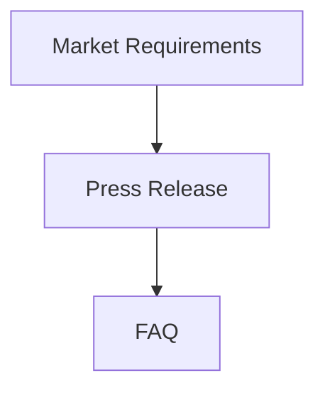

# v0.11.0 Release Notes

**Release Date:** 2026-07-06

This release introduces a generic workflow intermediate representation (IR) package for modeling specification pipelines as directed acyclic graphs (DAGs). The workflow IR enables visualization, dependency tracking, and progress monitoring across visionspec projects.

## Highlights

- Generic workflow IR package for DAG-based spec pipeline modeling
- specworkflow adapter for generating workflows from visionspec profiles
- CLI `workflow` command and MCP `get_workflow` tool for workflow visualization
- Mermaid diagram rendering for workflow pipelines
- Fixed spec ordering to maintain consistent PR-FAQ and category order

## What's New

### Workflow IR Package

A new generic workflow package (`pkg/workflow`) provides domain-agnostic DAG modeling:

```go
import "github.com/ProductBuildersHQ/visionspec/pkg/workflow"

// Create workflow
w := workflow.New("my-workflow")
w.AddPhase("discovery", "Discovery", 1)

// Add nodes with dependencies
w.AddNode(&workflow.Node{
    ID:        "mrd",
    Name:      "Market Requirements",
    Phase:     "discovery",
    DependsOn: []string{},
})

w.AddNode(&workflow.Node{
    ID:        "prd",
    Name:      "Product Requirements",
    Phase:     "product",
    DependsOn: []string{"mrd"},
})

// Check readiness
if w.IsReady("prd") {
    // All dependencies completed
}

// Get progress
completed, total, percent := w.Progress()
```

Features:

- **Phases**: Logical groupings/stages in the workflow
- **Nodes**: Work items with dependencies, status, and metadata
- **Status tracking**: pending, ready, in_progress, completed, blocked, skipped
- **Topological sort**: Dependency-ordered node traversal
- **Cycle detection**: Validates DAG structure
- **Progress calculation**: Completion statistics

### specworkflow Adapter

The `pkg/workflow/specworkflow` package adapts the generic workflow for visionspec:

```go
import "github.com/ProductBuildersHQ/visionspec/pkg/workflow/specworkflow"

// Generate workflow from profile
wf, err := specworkflow.FromProfile(profile)

// Update statuses from project state
specworkflow.UpdateFromProject(wf, project)
```

Node types map to spec categories:

| Category | Node Type |
|----------|-----------|
| Source | `source` |
| GTM | `gtm` |
| Technical | `technical` |
| Output | `output` |

### CLI Workflow Command

View project workflows from the command line:

```bash
# Display workflow diagram (Mermaid)
visionspec workflow -p myproject

# Output as JSON
visionspec workflow -p myproject --format json

# Output as DOT (GraphViz)
visionspec workflow -p myproject --format dot
```

### MCP get_workflow Tool

New MCP tool for AI assistants to query workflow state:

```json
{
  "tool": "get_workflow",
  "args": {
    "project": "myproject",
    "include_mermaid": true
  }
}
```

Returns nodes, dependencies, phases, progress metrics, and optional Mermaid diagram.

### Mermaid Rendering

Generate Mermaid diagrams from workflows:

```go
renderer := workflow.NewMermaidRenderer()
mermaid := renderer.Render(wf)
```

Output:



### Consistent Spec Ordering

Fixed spec ordering in `AllSpecs()` to ensure consistent order:

1. **By category**: source → gtm → technical → output
2. **Within GTM**: Press Release before FAQ (PR-FAQ order)
3. **Within category**: Workflow-defined order

## New Packages

| Package | Description |
|---------|-------------|
| `pkg/workflow` | Generic workflow IR for DAG modeling |
| `pkg/workflow/specworkflow` | visionspec profile adapter |

## CLI Changes

### New Commands

| Command | Description |
|---------|-------------|
| `workflow` | Display project workflow diagram |

### New Flags

| Flag | Command | Description |
|------|---------|-------------|
| `--format` | `workflow` | Output format: mermaid (default), json, dot |
| `--include-mermaid` | `workflow` | Include Mermaid in JSON output |

## MCP Changes

### New Tools

| Tool | Description |
|------|-------------|
| `get_workflow` | Get workflow DAG with nodes, dependencies, and progress |

## Bug Fixes

- **Spec ordering**: Fixed non-deterministic map iteration causing inconsistent spec order
- **PR-FAQ order**: Press Release now correctly appears before FAQ in GTM category
- **Lint errors**: Fixed unchecked errors in workflow tests using proper error handling helpers

## Documentation

- Added petstore-ai-agent example project demonstrating workflow with various spec states
- Updated README with hero image and links

## Dependencies

- Bump `github.com/plexusone/omnillm-core` to latest
- Bump `github.com/plexusone/structured-evaluation` to v0.8.0

## Installation

```bash
go install github.com/ProductBuildersHQ/visionspec/cmd/visionspec@v0.11.0
```

## Requirements

- Go 1.22+
- structured-evaluation v0.8.0

## Links

- [Documentation](https://productbuildershq.com/visionspec)
- [GitHub Repository](https://github.com/ProductBuildersHQ/visionspec)
- [Changelog](../changelog.md)
